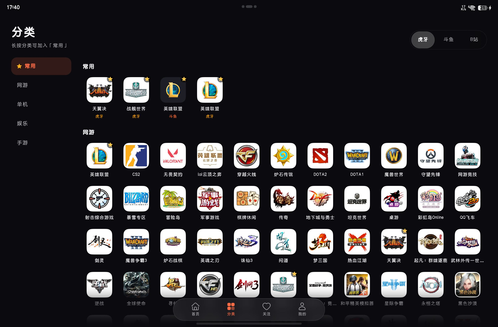

<div align="center">
  
  <h1>Lumen</h1>
  <p><strong>给鸿蒙平板的一间轻盈直播影院。</strong></p>
  <p>虎牙 · 斗鱼 · 哔哩哔哩｜ArkTS 原生界面｜ijkplayer</p>
  <p>
    <a href="https://github.com/xxz-0308/lumen-harmony/releases/latest">最新版本 / Latest Release</a> ·
    <a href="#构建与安装">构建与安装</a> ·
    <a href="https://github.com/xxz-0308/lumen-harmony/issues">反馈问题</a> ·
    <a href="THIRD_PARTY_NOTICES.md">开源致谢</a>
  </p>
</div>

---

Lumen 是参考 [Simple Live](https://github.com/xiaoyaocz/dart_simple_live) 的 HarmonyOS 原生直播客户端。它使用 ArkTS / ArkUI 构建，重点放在横屏观看、清晰的内容层级、克制的玻璃浮层，以及不打断观看的日常操作。

**这是个人维护的开发者版本，不是任何直播平台的官方客户端。** 平台接口、播放地址和弹幕协议可能变化；请勿把当前可用性理解为长期保证。

## 界面预览



*实机分类界面。截图中的分类图标、游戏名称等第三方内容归相应权利人所有，仅用于展示客户端界面；不包含账号、观看历史或聊天记录。*

## 可以做什么

- **三个直播平台**：虎牙、斗鱼、哔哩哔哩；热门推荐、分类浏览、主播 / 直播间搜索、链接与房间号识别。
- **平板优先的观看布局**：剧场模式、侧边聊天、全屏，以及清晰度和线路切换。
- **两套播放内核**：默认使用 ijkplayer，保留系统 AVPlayer 作为备选；内核切换在下次进入房间时生效。
- **两种弹幕展示**：实时侧边聊天与跟随播放缓存延后的飘屏弹幕。后者以约比画面早 1 秒为目标，不保证不同平台的绝对同步。
- **本地关注与历史**：主播关注、观看历史、常用分类；不依赖额外的云端服务。
- **观看时的便利功能**：画中画、后台音频、离开 App 暂停、定时关闭、屏蔽词、B站扫码登录。
- **外观与动效**：深色 / 浅色 / 跟随系统、主题色、浮动玻璃控制、进入时封面变形与返回时最后一帧缩回。

不提供弹幕发送、抖音接入、跨设备同步或绕过付费 / 权限限制的功能。画中画、后台音频和系统材质效果取决于设备及系统能力。

## v1.1.0 本轮亮点

- **长弹幕完整显示**：飘屏不再在 40 个长度单位后由客户端加省略号；侧边聊天仍显示原文。
- **操作更连贯**：搜索刷新保留可用结果，分类切换保持当前位置，房间选项卡关闭方式统一。
- **定时输入更可达**：一个有界滚动主体容纳预设和自定义输入，键盘出现时不再把关闭入口顶出视口。
- **减少无用功**：离屏活动、关注状态通知和图片缓存更有边界；不改变稳定下来的播放策略，也不宣称未经测量的省电比例。

详见 [最新 Release](https://github.com/xxz-0308/lumen-harmony/releases/latest) 和 [更新记录](CHANGELOG.md)。弹幕发送与斗鱼账号登录仍未实现，相关可行性研究不是本版本功能。

## 兼容范围

| 项目 | 当前配置 |
| --- | --- |
| 系统 | HarmonyOS，compatible SDK **API 24** |
| 编译目标 | HarmonyOS SDK **API 26** |
| 主要实机 | MatePad 平板，HarmonyOS 6.1 / API 24 |
| 包名 | `com.zyf.lumen` |
| 语言 | 简体中文 |
| 发布包架构 | ARM64；不打包 x86_64 播放器库 |

项目声明支持 tablet / phone / 2in1，但当前以横屏平板的实机使用为主。手机、分屏、小窗及其他系统版本没有完整覆盖验证；旧版鸿蒙、Android APK 安装环境并不在当前支持范围内。

## 下载说明

在 [Releases](https://github.com/xxz-0308/lumen-harmony/releases) 下载开发者预览包、校验文件与源码。

> **公开 HAP 是未签名包，不是下载后点一下就能安装的通用安装包。**
> HarmonyOS 真机安装需要有效签名及适用于目标设备的 Profile。仓库和 Release 不包含个人证书、私钥、设备 UDID 或绑定原开发者设备的调试签名。请按下面的说明使用自己的签名配置构建 / 重签；没有 DevEco 与签名环境时，请暂时不要把它当作普通用户安装版。

当前项目没有 AppGallery 分发渠道。不要安装来源不明的二次签名包，也不要为了安装本项目分享自己的私钥、Profile 或账号令牌。

## 构建与安装

### 1. 准备开发环境

安装提供 **HarmonyOS API 26** 编译环境的 DevEco Studio，并准备：

- HarmonyOS SDK（工程 compatible 版本为 `6.1.1(24)`，target 为 `26.0.0`）；
- IDE 自带的 Node.js、ohpm、Hvigor 工具；
- 如需真机安装，在自己的华为开发者账号下配置签名及目标设备。

```bash
git clone https://github.com/xxz-0308/lumen-harmony.git
cd lumen-harmony
ohpm install
```

如果命令不在 PATH 中，可以在 DevEco Studio 的终端中执行，或把 IDE 的 `tools/node`、`tools/ohpm/bin` 和 `tools/hvigor/bin` 加入 PATH。

### 2. 未签名构建

使用 DevEco Studio 打开工程，等待依赖同步，然后执行 Release 构建。也可以使用 CLI：

```bash
hvigorw --mode module -p product=default -p module=entry@default -p buildMode=release assembleHap --no-daemon
```

Windows 上命令名可能是 `hvigorw.bat`。仓库还提供 `build.sh`，在 Git Bash 中设置 `DEVECO_HOME` 后可运行：

```bash
# 按实际安装位置填写，不需要修改脚本。
export DEVECO_HOME="D:/tools/devecostudio/DevEco Studio"
bash build.sh
```

默认产物：

```text
entry/build/default/outputs/default/entry-default-unsigned.hap
```

### 3. 使用自己的签名安装

在 DevEco Studio 的 **File → Project Structure → Signing Configs** 中配置自己的签名与目标设备，或用 IDE 配套签名工具对未签名 HAP 重签。签名成功后，通过 IDE 的 Run 或 hdc 安装：

```bash
hdc list targets
hdc -t <device-id> install -r entry/build/default/outputs/default/entry-default-signed.hap
hdc -t <device-id> shell aa start -a EntryAbility -b com.zyf.lumen
```

`install -r` 是覆盖安装；只有签名与包名兼容时才能覆盖已有应用。签名不一致时，不要为了安装而盲目清除已有数据。

**本地签名之后不要提交 DevEco 写入的 signingConfigs、密码、证书路径或设备信息。** 当前公开 `build-profile.json5` 保持无签名配置；可以将个人版本另存为被忽略的 `build-profile.local.json5`。构建前在本地使用，提交前恢复公开版本。`tools/check-public-files.py` 会拒绝有签名配置的公开提交。

## 工程结构

```text
AppScope/                     应用信息与分层图标
entry/src/main/ets/
  app/                        设置、导航、关注与历史状态
  core/                       平台协议、HTTP、弹幕、Tars 等
  player/                     ijkplayer / AVPlayer、斗鱼本地续流
  room/                       房间模型、视频层、聊天与选项面板
  pages/                      页面入口与直播间
  components/                 通用界面组件
  views/                      首页、分类、关注、搜索、设置等
  platform/                   HarmonyOS 网络、音频、PiP、凭据存储
  danmaku/                    飘屏画布与消息延迟队列
  theme/                      主题与布局常量
  util/                       日志、图片与背景光晕加载
LICENSES/                     第三方许可副本
tools/verify/                 Node 侧协议 / 状态回归与平台模拟
```

`@ohos/ijkplayer` 由 ohpm 安装，当前 lockfile 对应 **2.0.11**。`oh_modules`、SDK、编译产物和个人签名材料都不提交到仓库。

开发者可选运行离线回归（不是本次发布重新执行的测试声明）：

```bash
cd tools/verify
npm ci
npm run test:danmaku
npm run test:ijk-player
npm run test:bullet-delay
```

`npm run verify` 则会访问真实平台接口，不属于纯离线检查。Node 模拟不能替代 HarmonyOS 真机验证。

## 已知限制与反馈

- 平台非官方接口可能变化。能打开视频不代表弹幕订阅一定正常；需要结合连接、加组和收包统计排查。
- ijkplayer 更注重直播的连续播放，可能保留数秒缓存，因此实际直播延迟不一定低。
- 转场性能已做定向优化，但仍可能出现偶发长帧；不同入口和设备的流畅度不完全相同。
- 底栏材质、画中画、横竖屏以及后台行为受系统状态影响。暂不承诺所有设备一致。
- 项目仍在迭代。发布准备期间没有重新跑完整测试或新的性能长测。

提交 [Issue](https://github.com/xxz-0308/lumen-harmony/issues) 时建议写明：系统 / 设备、平台与房间号、操作步骤、是否切换网络 / 前后台，以及视频与侧栏是否同时异常。分享日志前请移除账号令牌、Cookie、昵称 / 聊天内容、私钥和设备标识。

## 数据与权限

关注、历史和设置保存于设备本地；B站登录信息通过系统凭据存储封装保存。正常使用需要直接请求对应直播平台，平台仍可能按自身政策记录网络访问。

本项目没有自建业务服务器或内置广告 / 分析 SDK。运行时日志用于排查故障；弹幕收包汇总不记录聊天文本和发送者标识。

声明的权限包括网络、通知策略访问和后台运行；实际能力以系统授权为准。公开仓库不包含个人账号数据或原开发环境的调试记录。

## 许可与致谢

项目源代码以 **GPL-3.0-or-later** 发布，见 [LICENSE](LICENSE)。

- [xiaoyaocz/dart_simple_live](https://github.com/xiaoyaocz/dart_simple_live)：功能与平台协议参考，保留其开源归属与 GPL 许可。
- [OpenHarmony ijkplayer](https://gitcode.com/CPF-ApplicationTPC/ohos_ijkplayer)：默认播放器适配层，LGPL-2.1-or-later；其基础项目为 [bilibili/ijkplayer](https://github.com/bilibili/ijkplayer)。
- FFmpeg、OpenSSL、SoundTouch、libyuv、LLVM / libc++：播放器涉及的第三方组件，保持各自原许可；详见 [第三方说明](THIRD_PARTY_NOTICES.md)。
- HarmonyOS / OpenHarmony 与 ArkUI：系统开发框架与界面能力。

平台名称、标识、封面及直播内容归相应权利人所有，不受本仓库的软件许可证重新授权。本项目只提供客户端代码，不托管或转售直播内容；使用者应遵守平台条款、所在地法律及内容版权要求。
